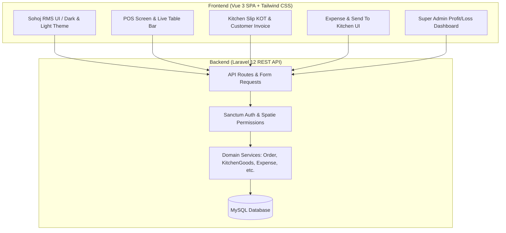
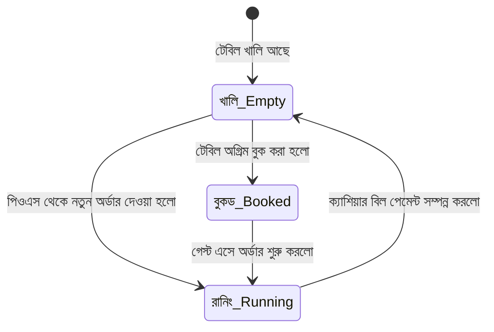
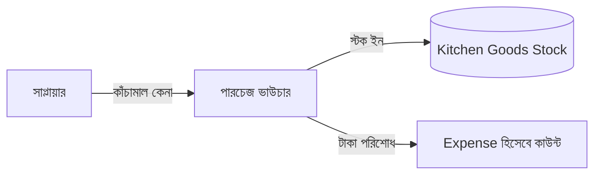
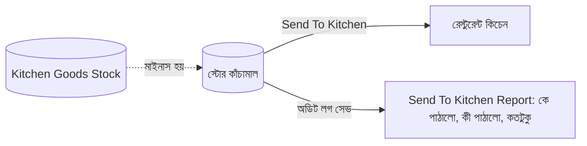
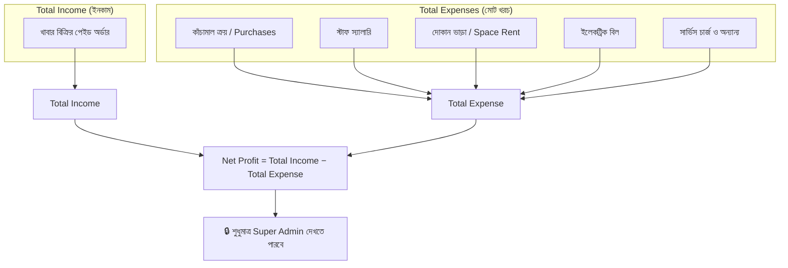

# 📖 Sohoj RMS (Restaurant Management System) — Full Development Documentation & Implementation Roadmap

> **প্রজেক্টের উদ্দেশ্য:** `Foodscan` প্রজেক্টকে `RMS development directtion.pdf` এবং `Sohoj RMS Design Complete.html` ডকুমেন্টের সকল রিকোয়ারমেন্ট অনুযায়ী একটি পূর্ণাঙ্গ, আধুনিক ও প্রফেশনাল **রেস্টুরেন্ট ম্যানেজমেন্ট সিস্টেম (Sohoj RMS)**-এ রূপান্তর করা।

---

## 📑 সূচিপত্র (Table of Contents)

1. [সিস্টেম আর্কিটেকচার ও টেক স্ট্যাক](#1-সিস্টেম-আর্কিটেকচার-ও-টেক-স্ট্যাক)
2. [মডিউলভিত্তিক গ্যাপ ও সমাধান সারাংশ](#2-মডিউলভিত্তিক-গ্যাপ-ও-সমাধান-সারাংশ)
3. [ধাপ ১: থিম ও গ্লোবাল ইউআই ডিজাইন সিস্টেম (Dark/Light Mode & Sohoj UI)](#ধাপ-১-থিম-ও-গ্লোবাল-ইউআই-ডিজাইন-সিস্টেম)
4. [ধাপ ২: ডাইনিং টেবিল ও রানিং/খালি স্টেট লজিক (Table Management)](#ধাপ-২-ডাইনিং-টেবিল-ও-রানিংখালি-স্টেট-লজিক)
5. [ধাপ ৩: পিওএস প্যানেল রূপান্তর ও ডুয়াল স্লিপ প্রিন্টিং (POS, Slips & Note Exchange)](#ধাপ-৩-পিওএস-প্যানেল-রূপান্তর-ও-ডুয়াল-স্লিপ-প্রিন্টিং)
6. [ধাপ ৪: কিচেন গুডস (কাঁচামাল), সাপ্লায়ার ও পারচেজ মডিউল (Kitchen Goods & Inventory)](#ধাপ-৪-কিচেন-গুডস-কাঁচামাল-সাপ্লায়ার-ও-পারচেজ-মডিউল)
7. [ধাপ ৫: সেন্ট টু কিচেন স্টক ট্র্যাকিং ও অডিট লগ (Send To Kitchen Logic)](#ধাপ-৫-সেন্ট-টু-কিচেন-স্টক-ট্র্যাকিং-ও-অডিট-লগ)
8. [ধাপ ৬: এক্সপেন্স ম্যানেজমেন্ট সিস্টেম (Expense Management)](#ধাপ-৬-এক্সপেন্স-ম্যানেজমেন্ট-সিস্টেম)
9. [ধাপ ৭: লাভ-ক্ষতি ও ইনকাম-এক্সপেন্স ড্যাশবোর্ড (Profit & Loss Analytics)](#ধাপ-৭-লাভ-ক্ষতি-ও-ইনকাম-এক্সপেন্স-ড্যাশবোর্ড)
10. [ধাপ ৮: ডাটাবেস মাইগ্রেশন ও মডেল ডিজাইন তালিকা](#ধাপ-৮-ডাটাবেস-মাইগ্রেশন-ও-মডেল-ডিজাইন-তালিকা)
11. [ধাপ ৯: ল্যাঙ্গুয়েজ ও লোকালাইজেশন (Bangla & English)](#ধাপ-৯-ল্যাঙ্গুয়েজ-ও-লোকালাইজেশন)
12. [ধাপ ১০: স্টেপ-বাই-স্টেপ এক্সিকিউশন চেকলিস্ট](#ধাপ-১০-স্টেপ-বাই-স্টেপ-এক্সিকিউশন-চেকলিস্ট)

---

## 1. সিস্টেম আর্কিটেকচার ও টেক স্ট্যাক



* **Backend:** Laravel 12, PHP 8.2+, Sanctum Token Auth, Spatie RBAC v6, Spatie MediaLibrary v11.
* **Frontend:** Vue 3 (Options API for pages), Vuex 4, Vue Router 4, Tailwind CSS 3, FontAwesome 6, Hind Siliguri Google Font, vue-i18n.
* **Database:** MySQL / SQLite with foreign keys & indexed query patterns.

---

## 2. মডিউলভিত্তিক গ্যাপ ও সমাধান সারাংশ

| মডিউল | ফুডসখানে যা আছে | Sohoj RMS রিকোয়ারমেন্ট (PDF ও HTML) | করণীয় কাজ |
|---|---|---|---|
| **Theme & Style** | লাইট থিম, নীল/পার্পল ব্র্যান্ডিং | ডার্ক/লাইট মোড টগল, কমলা/অ্যাম্বার সোহজ থিম | Tailwind `dark:` ক্লাস ইন্টিগ্রেশন, থিম টগল বাটন |
| **Dining Table** | সাধারণ টেবিল ড্রপডাউন | টপ বার টেবিল পিল, লাইভ রানিং/খালি/বুকড ব্যাজ | লাইভ টেবিল স্ট্যাটাস লজিক ও ফিল্টার বার |
| **POS Checkout** | মডাল পপআপ পেমেন্ট | ডানদিকের ফুল ইনলাইন প্যানেল, কাস্টমার সুইচ | ইনলাইন কাস্টমার ক্রিয়েশন, ওয়ান-ক্লিক চলমান কাস্টমার |
| **Cash Calculation** | সাধারণ অ্যামাউন্ট বক্স | নোট দিলেন -> খুচরা ফেরত (Change) ক্যালকুলেটর | লাইভ ক্যাশ এক্সচেঞ্জ বক্স (শুধু Cash মেথডে দৃশ্যমান) |
| **Receipt / Slips** | ১টি সাধারণ ইনভয়েস | ১. কিচেন স্লিপ (KOT) এবং ২. কাস্টমার ইনভয়েস | আলাদা ২ ধরণের প্রিন্ট স্লিপ কম্পোনেন্ট |
| **Raw Materials** | কোনো কাঁচামাল অপশন নেই | কিচেন গুডস (চাল, তেল, মাংস, মসলা), ইউনিট ও ক্যাটাগরি | Kitchen Goods, Unit, Category ডাটাবেস ও ইউআই |
| **Suppliers** | নেই | সাপ্লায়ার প্রোফাইল ও পারচেজ হিস্ট্রি | Supplier ও Purchase মডিউল তৈরি (পারচেজ = Expense) |
| **Stock Out** | নেই | সেন্ট টু কিচেন (Send To Kitchen) ও অডিট লগ | কিচেনে মাল পাঠানোর ফর্ম ও ইউজার লগ রিপোর্ট |
| **Expenses** | সম্পূর্ণ অনুপস্থিত | স্যালারি, কারেন্ট বিল, ভাড়া, সার্ভিস চার্জ ইত্যাদি | সম্পূর্ণ Expense Management মডিউল তৈরি |
| **Profit & Loss** | শুধু সেলস ওভারভিউ | Total Income − Total Expense = Net Profit | সুপার এডমিন লাভ-ক্ষতি ড্যাশবোর্ড ও ডেট ফিল্টারিং |

---

## ধাপ ১: থিম ও গ্লোবাল ইউআই ডিজাইন সিস্টেম

### ১.১ ডার্ক ও লাইট থিম সুইচিং (Theme Toggle)
* **Tailwind কনফিগারেশন (`tailwind.config.js`):**
  ```javascript
  module.exports = {
    darkMode: 'class',
    theme: {
      extend: {
        colors: {
          brand: {
            50: '#fff7ed',
            100: '#ffedd5',
            500: '#f97316', // Primary Orange
            600: '#ea580c',
            700: '#c2410c',
          }
        },
        fontFamily: {
          bengali: ['"Hind Siliguri"', 'sans-serif'],
        }
      }
    }
  }
  ```
* **থিম স্টেট হ্যান্ডলিং (`resources/js/store/modules/theme.js`):**
  - লোকাল স্টোরেজে থিম প্রেফারেন্স সেভ করা (`localStorage.getItem('rms_theme')`).
  - `document.documentElement.classList.toggle('dark')` হ্যান্ডলার।
  - সাইডবার হেডারে সান/মুন আইকন বাটন।

### ১.২ সাইডবার মেনু লেআউট (`BackendMenuComponent.vue`)
Sohoj RMS ডিজাইনের সাথে মিল রেখে সাইডবার পুনর্গঠন:
1. 📊 **ড্যাশবোর্ড** (`/admin/dashboard`)
2. 🛒 **পিওএস (POS)** (`/admin/pos`)
3. 📋 **অর্ডার ম্যানেজমেন্ট** (`/admin/orders`)
4. 📖 **খাবার ক্যাটাগরি ও মেনু** (`/admin/items` / `/admin/item-categories`)
5. 🪑 **টেবিল ম্যানেজমেন্ট** (`/admin/dining-tables`)
6. 🍳 **কিচেন (KDS)** (`/admin/kitchen-display-system`)
7. 💼 **এক্সপেন্স ম্যানেজমেন্ট (Dropdown):**
   - স্টাফ স্যালারি
   - ইলেকট্রিক বিল
   - স্পেইস রেন্ট
   - সার্ভিস চার্জ
   - অন্যান্য খরচ
8. 🚚 **এড সাপ্লায়ার ও পারচেজ** (`/admin/suppliers` & `/admin/purchases`)
9. 📦 **ইনভেন্টরি ও সেন্ট টু কিচেন** (`/admin/kitchen-goods` & `/admin/send-to-kitchen`)
10. 📈 **সেলস ও প্রফিট রিপোর্ট** (`/admin/sales-report` & `/admin/profit-loss-report`)

---

## ধাপ ২: ডাইনিং টেবিল ও রানিং/খালি স্টেট লজিক



### ২.১ ডাটাবেস আপডেট (`dining_tables`)
* **নতুন কলাম যোগ:**
  - `status`: ENUM (`1` = খালি/Available, `2` = রানিং/Running, `3` = বুকড/Booked)
  - `current_order_id`: আনপেইড রানিং অর্ডারের ফরেন কি
  - `capacity`: আসন সংখ্যা
  - `serial_no`: টেবিল ক্রমিক নম্বর

### ২.২ পিওএস টপ টেবিল বার কম্পোনেন্ট
* পিওএসের উপরে হরিজন্টাল স্ক্রলে প্রতিটি টেবিলের পিল বাটন থাকবে।
* বাটনে ক্লিক করলে:
  - টেবিল যদি **খালি** থাকে: কার্ট ফ্রেশ শুরু হবে এবং নির্বাচিত টেবিল আইডি যুক্ত হবে।
  - টেবিল যদি **রানিং** থাকে: ওই টেবিলের চলমান আনপেইড আইটেমগুলো কার্টে লোড হবে, নতুন আইটেম যোগ করে কিচেন স্লিপ দেওয়া যাবে অথবা সরাসরি বিল পেমেন্ট করা যাবে।
  - টেবিল যদি **পার্সেল / টেক-অ্যাওয়ে** হয়: টেবিল আইডি `null` হবে এবং টেক-অ্যাওয়ে মোড অন হবে।

---

## ধাপ ৩: পিওএস প্যানেল রূপান্তর ও ডুয়াল স্লিপ প্রিন্টিং

### ৩.১ পিওএস ৩-কলাম লেআউট (`PosComponent.vue`)
1. **হেডার অংশ:** পিওএস টার্মিনাল সচল ব্যাজ (গ্রিন পালস অ্যানিমেশন), লাইভ ঘড়ি ও তারিখ, এবং লাইভ খাবার সার্চ ইনপুট।
2. **মাঝের অংশ:**
   - **টপ টেবিল স্ট্রিপ** (সব টেবিলের স্ট্যাটাস)।
   - **ক্যাটাগরি গ্রিড (১০টি ক্যাটাগরি)**: সব খাবার, বিরিয়ানি, ফাস্টফুড, পিজা, গ্রিল, ডেজার্ট, জুস, স্যুপ, সি-ফুড, ব্রেকফাস্ট।
   - **ফুড আইটেম কার্ড গ্রিড:** খাবারের ছবি, নাম, প্রাইস ব্যাজ (`৳ ৩৫০`), এবং "যোগ করুন" বাটন।
3. **ডানদিকের বিলিং প্যানেল (Cart & Checkout Drawer):**
   - চলমান অর্ডার ও টেবিল নম্বর হেডার।
   - **কাস্টমার সুইচ অপশন:**
     - **[কাস্টমার যোগ করুন]:** নাম ও ফোন নম্বর ইনপুট।
     - **[চলমান কাস্টমার / Walk-in]:** কোনো নাম-নম্বর লাগবে না।
   - সিলেক্টেড খাবার আইটেমের তালিকা, প্লাস/মাইনাস বাটন ও ডিলিট আইকন।
   - **ক্যাশ রিসিভ ও খুচরা হিসাব কার্ড (Note Exchange):**
     - ইনপুট: *নোট দিল (টাকা)* [যেমন: ১০০০]
     - ডিসপ্লে: *মোট বিল* [যেমন: ৳ ৯৫০.০০]
     - আউটপুট: *খুচরা ফেরত (Change)* [৳ ৫০.০০] (সবুজ ব্যাজ)
     - **লজিক:** ক্যাশ ছাড়া অন্য পেমেন্ট মেথড (বিকাশ/রকেট/কার্ড) সিলেক্ট করলে এই কার্ড হাইড থাকবে।
   - **পেমেন্ট মেথড গ্রিড:** ক্যাশ, বিকাশ, রকেট, কার্ড (ডাইনামিক অ্যাডযোগ্য)।
   - **বিল সামারি:** সাবটোটাল, ভ্যাট (%), ডিসকাউন্ট (%), প্রদেয় মোট বিল।
   - **অ্যাকশন বাটন:**
     - **[কিচেন স্লিপ]** বাটন (অর্ডার কিচেনে পাঠাবে ও স্লিপ প্রিন্ট করবে)।
     - **[পেমেন্ট সম্পন্ন]** বাটন (বিল পেইড করবে, টেবিল খালি করবে এবং ইনভয়েস প্রিন্ট করবে)।

### ৩.২ ডুয়াল স্লিপ প্রিন্ট স্পেসিফিকেশন

#### ক) কিচেন স্লিপ (Kitchen Slip / KOT)
```
=========================================
            KITCHEN SLIP #1042
=========================================
Table: টেবিল নং-০১
Date & Time: 31-Aug-2026 10:15 AM
Waiter: করিম
-----------------------------------------
SL   Item Name              Qty   Notes
-----------------------------------------
1.   কাচ্চি বিরিয়ানি স্পেশাল  1     ঝাল কম
2.   চিকেন চিজ বার্গার       2     এক্সট্রা চিজ
-----------------------------------------
Total Items: 3
=========================================
```

#### খ) কাস্টমার পেমেন্ট ইনভয়েস (Payment Invoice)
```
=========================================
            PAYMENT INVOICE #INV-5089
              সহজ রেস্টুরেন্ট
          ধানমন্ডি, ঢাকা | ফোন: ০১৭১১...
=========================================
Table: টেবিল নং-০১ | Order #1042
Customer: রাহিম আহমেদ (01711-XXXXXX)
Date: 31-Aug-2026 10:45 AM
-----------------------------------------
SL   Item Name              Qty     Total
-----------------------------------------
1.   কাচ্চি বিরিয়ানি স্পেশাল  1    ৳ ৩৫০.০০
2.   চিকেন চিজ বার্গার       2    ৳ ৪৪০.০০
-----------------------------------------
Subtotal:                         ৳ ৭৯০.০০
VAT (5%):                          ৳ ৩৯.৫০
Discount (5%):                   - ৳ ৩৯.৫০
-----------------------------------------
Total Payable:                    ৳ ৭৯০.০০
Paid Method: CASH
Note Given (নোট দিল):            ৳ ১০০০.০০
Change Return (খুচরা ফেরত):       ৳ ২১০.০০
=========================================
       ধন্যবাদ! আবার আসবেন।
```

---

## ধাপ ৪: কিচেন গুডস (কাঁচামাল), সাপ্লায়ার ও পারচেজ মডিউল



### ৪.১ ডাটাবেস টেবিল
1. **`units`:** `id`, `name` (কেজি, লিটার, গ্রাম, পিস, প্যাকেট), `code`, `status`.
2. **`kitchen_goods_categories`:** `id`, `name`, `image`, `status`.
3. **`kitchen_goods`:** `id`, `name`, `kitchen_goods_category_id`, `unit_id`, `current_stock`, `cost_per_unit`, `status`.
4. **`suppliers`:** `id`, `name`, `company_name`, `email`, `phone`, `address`, `status`.
5. **`purchases` & `purchase_items`:** `supplier_id`, `invoice_no`, `date`, `total_amount`, `paid_amount`, `payment_method`, `items...`.

### ৪.২ বিজনেস লজিক
* যখন সাপ্লায়ারের কাছ থেকে পারচেজ কনফার্ম করা হবে:
  1. পারচেজকৃত আইটেমের কোয়ান্টিটি স্বয়ংক্রিয়ভাবে `kitchen_goods.current_stock`-এ যোগ হবে।
  2. পারচেজ খরচের মোট টাকাটি স্বয়ংক্রিয়ভাবে সিস্টেমের **Total Expense**-এ যুক্ত হবে।

---

## ধাপ ৫: সেন্ট টু কিচেন স্টক ট্র্যাকিং ও অডিট লগ



### ৫.১ ডাটাবেস টেবিল (`send_to_kitchens` & `send_to_kitchen_items`)
* `send_to_kitchens`: `id`, `date`, `created_by_user_id` (কে পাঠিয়েছে), `note`, `total_items`.
* `send_to_kitchen_items`: `send_to_kitchen_id`, `kitchen_goods_id`, `quantity`, `unit_id`.

### ৫.২ কার্যপদ্ধতি ও রিপোর্টিং
1. ইউজার স্টোর রুম থেকে কিচেনে চাল, মাংস বা মসলা ইস্যু করতে **"Send To Kitchen"** বাটনে ক্লিক করে ফর্ম পূরণ করবে।
2. সাবমিট করার সাথে সাথে `kitchen_goods` টেবিল থেকে নির্দিষ্ট পরিমাণ স্টক কমে যাবে (Stock OUT)।
3. **রিপোর্টিং পেইজ:**
   - তারিখ অনুযায়ী ফিল্টারিং।
   - কে পাঠিয়েছে (স্টাফ/ম্যানেজার নাম)।
   - কোন প্রোডাক্ট কতটুকু কিচেনে দেওয়া হয়েছে।
   - এক্সেল ও পিডিএফ এক্সপোর্ট সুবিধা।

---

## ধাপ ৬: এক্সপেন্স ম্যানেজমেন্ট সিস্টেম

### ৬.১ ডাটাবেস টেবিল (`expense_categories` ও `expenses`)
* **`expense_categories`:**
  - `1` = স্টাফ স্যালারি (Staff Salary)
  - `2` = ইলেকট্রিক বিল (Electric Bills)
  - `3` = স্পেইস রেন্ট / দোকান ভাড়া (Space Rent)
  - `4` = সার্ভিস চার্জ (Service Charge)
  - `5` = অন্যান্য (Other Expenses)
* **`expenses`:**
  - `id`, `expense_category_id`, `title`, `amount`, `date`, `payment_method`, `payee_name`, `voucher_file`, `note`, `created_by`.

### ৬.২ ইউআই ও মেনু ইন্টিগ্রেশন
* সাইডবারে এক্সপেন্স ড্রপডাউন থাকবে যাতে সরাসরি ক্যাটাগরি অনুযায়ী ফিল্টার করা যায়।
* নতুন খরচ এন্ট্রি দেওয়ার জন্য কুইক ফর্ম এবং ভাউচার আপলোড সুবিধা।

---

## ধাপ ৭: লাভ-ক্ষতি ও ইনকাম-এক্সপেন্স ড্যাশবোর্ড



### ৭.১ ক্যালকুলেশন লজিক (`DashboardService.php`)
$$\text{Total Sales (Income)} = \sum \text{Orders (payment\_status = PAID)}$$
$$\text{Total Expense} = \sum \text{Purchases} + \sum \text{Expenses (Salary + Rent + Bills + Service)}$$
$$\text{Total Net Profit} = \text{Total Income} - \text{Total Expense}$$

### ৭.২ সুপার এডমিন ড্যাশবোর্ড উইজেট
1. **Total Income (Sales) কার্ড** (সবুজ অ্যাকসেন্ট)
2. **Total Expense কার্ড** (লাল/অরেঞ্জ অ্যাকসেন্ট)
3. **Net Profit কার্ড** (ব্লু অ্যাকসেন্ট — লাভ হলে গ্রিন গ্রাফ, লস হলে রেড ইন্ডিকেটর)
4. **প্রফিট/লস চার্ট:** মাসিক ও দৈনিক সেলস বনাম খরচের তুলনা বার-চার্ট।
5. **পারমিশন গার্ড:** `App\Enums\Role::SUPER_ADMIN` অথবা `permission:view_profit_loss` দিয়ে সুরক্ষিত রাখা।

---

## ধাপ ৮: ডাটাবেস মাইগ্রেশন ও মডেল ডিজাইন তালিকা

তৈরি করতে হবে এমন নতুন মাইগ্রেশন ফাইলসমূহ:

1. `create_units_table.php`
2. `create_kitchen_goods_categories_table.php`
3. `create_kitchen_goods_table.php`
4. `create_suppliers_table.php`
5. `create_purchases_and_items_tables.php`
6. `create_send_to_kitchens_and_items_tables.php`
7. `create_expense_categories_and_expenses_tables.php`
8. `add_status_and_order_fields_to_dining_tables.php`
9. `add_change_and_slip_type_to_orders.php`

---

## ধাপ ৯: ল্যাঙ্গুয়েজ ও লোকালাইজেশন

বাংলা (`resources/js/languages/bn.json`) ও ইংরেজি (`en.json`) ফাইলে নতুন কি (Key) যোগ করতে হবে:

```json
{
  "menu": {
    "dashboard": "ড্যাশবোর্ড",
    "pos": "পিওএস (POS)",
    "order_management": "অর্ডার ম্যানেজমেন্ট",
    "food_menu": "খাবার ক্যাটাগরি ও মেনু",
    "table_management": "টেবিল ম্যানেজমেন্ট",
    "kds": "কিচেন (KDS)",
    "expense_management": "এক্সপেন্স ম্যানেজমেন্ট",
    "staff_salary": "স্টাফ স্যালারি",
    "electric_bill": "ইলেকট্রিক বিল",
    "space_rent": "স্পেইস রেন্ট",
    "service_charge": "সার্ভিস চার্জ",
    "suppliers": "এড সাপ্লায়ার",
    "purchases": "পারচেজ",
    "inventory": "ইনভেন্টরি",
    "send_to_kitchen": "সেন্ট টু কিচেন"
  },
  "label": {
    "kitchen_slip": "কিচেন স্লিপ",
    "payment_invoice": "পেমেন্ট ইনভয়েস",
    "note_given": "নোট দিল (টাকা)",
    "change_return": "খুচরা ফেরত (Change)",
    "walk_in_customer": "চলমান কাস্টমার",
    "table_running": "রানিং",
    "table_empty": "খালি",
    "table_booked": "বুকড",
    "total_income": "মোট ইনকাম",
    "total_expense": "মোট খরচ",
    "net_profit": "নিট প্রফিট"
  }
}
```

---

## ধাপ ১০: স্টেপ-বাই-স্টেপ এক্সিকিউশন চেকলিস্ট

```
[ ] Phase 1: Database & Migrations
    [ ] 1.1 Create Kitchen Goods, Units, Categories migrations
    [ ] 1.2 Create Suppliers, Purchases, Purchase Items migrations
    [ ] 1.3 Create Send To Kitchen & Items migrations
    [ ] 1.4 Create Expense Categories & Expenses migrations
    [ ] 1.5 Update Dining Tables & Orders migrations
    [ ] 1.6 Seed default roles, permissions & expense categories

[ ] Phase 2: Backend Laravel Services & APIs
    [ ] 2.1 KitchenGoodsService, UnitService, SupplierService, PurchaseService
    [ ] 2.2 SendToKitchenService with stock reduction logic
    [ ] 2.3 ExpenseService & ExpenseCategoryService
    [ ] 2.4 PosOrderService update (Note exchange, live table status change)
    [ ] 2.5 DashboardService update (Income, Expense, Net Profit formulas)

[ ] Phase 3: Global Theme & Sidebar Navigation
    [ ] 3.1 Dark / Light mode toggle implementation
    [ ] 3.2 Sohoj RMS Orange styling integration
    [ ] 3.3 Sidebar menu reorganization matching design

[ ] Phase 4: POS & Table State Frontend
    [ ] 4.1 Top Dining Table selector bar with live status pills
    [ ] 4.2 3-Column POS Screen redesign matching Sohoj HTML
    [ ] 4.3 Inline Customer switch (Add Customer vs Walk-in)
    [ ] 4.4 Cash Note Exchange & Change Calculator
    [ ] 4.5 Kitchen Slip (KOT) print component
    [ ] 4.6 Customer Payment Invoice print component

[ ] Phase 5: Inventory, Send To Kitchen & Expenses Frontend
    [ ] 5.1 Kitchen Goods CRUD & Stock Overview
    [ ] 5.2 Supplier & Purchase Management UI
    [ ] 5.3 Send To Kitchen issue modal & Audit Log report
    [ ] 5.4 Expense Management UI with category dropdown

[ ] Phase 6: Super Admin Profit & Loss Dashboard
    [ ] 6.1 Overview cards (Total Sales, Total Expenses, Net Profit)
    [ ] 6.2 Date-range filtering (Today, This month, Custom)
    [ ] 6.3 Super Admin permission protection
```

---
*ডকুমেন্টটি `RMS development directtion.pdf` এবং `Sohoj RMS Design Complete.html`-এর ১০০% স্পেসিফিকেশন ও বিজনেস লজিক অনুযায়ী প্রস্তুত করা হয়েছে।*
